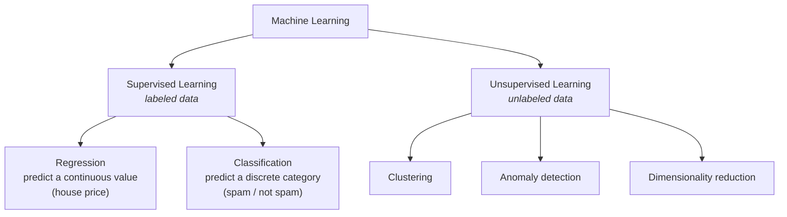
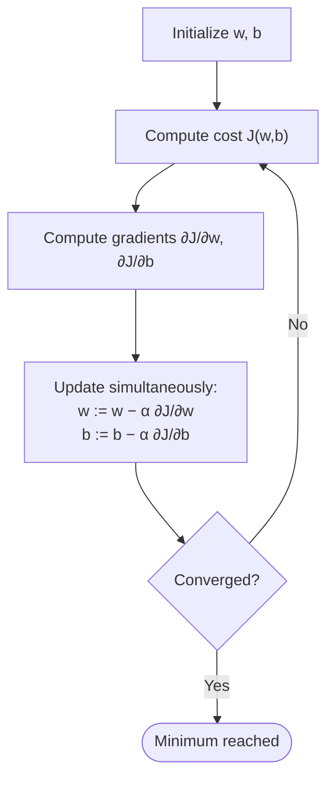
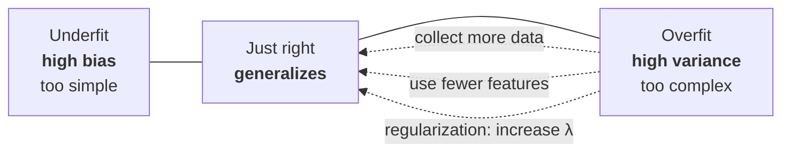

# 01 — Supervised Machine Learning: Regression and Classification

[](https://www.coursera.org/learn/machine-learning/home/info)


> [!NOTE]
> Notes and lab solutions for **Course 1** of the DeepLearning.AI / Stanford Machine Learning Specialization.
> Course home: <https://www.coursera.org/learn/machine-learning/home/info>

## Contents

- [Week 1: Introduction to Machine Learning](#week-1-introduction-to-machine-learning)
  - [Definitions](#definitions)
  - [Intro Supervised Learning](#intro-supervised-learning)
  - [Intro to Unsupervised Learning](#intro-to-unsupervised-learning)
  - [Linear regression](#linear-regression)
  - [Squared Error Cost function](#squared-error-cost-function)
  - [Gradient Descent](#gradient-descent)
  - [Week 1: Labs](#week-1-labs)
- [Week 2: Regression with multiple input variables](#week-2-regression-with-multiple-input-variables)
  - [Multiple variable linear regression](#multiple-variable-linear-regression)
  - [Vectorization](#vectorization)
  - [Gradient Descent with multiple variables](#gradient-descent-with-multiple-variables)
  - [Week 2: Labs](#week-2-labs)
- [Week 3: Classification](#week-3-classification)
  - [Classification with logistic regression](#classification-with-logistic-regression)
  - [Decision boundary](#decision-boundary)
  - [Cost function for logistic regression](#cost-function-for-logistic-regression)
  - [Overfitting and regularization](#overfitting-and-regularization)
  - [Regularization to address overfitting](#regularization-to-address-overfitting)
  - [Week 3: Labs](#week-3-labs)

---

## Week 1: Introduction to Machine Learning

> [!NOTE]
> Welcome to the Machine Learning Specialization! You're joining millions of others who have taken either this or the original course, which led to the founding of Coursera, and has helped millions of other learners, like you, take a look at the exciting world of machine learning!

<details>
<summary><b>Learning Objectives</b></summary>

* Define machine learning
* Define supervised learning
* Define unsupervised learning
* Write and run Python code in Jupyter Notebooks
* Define a regression model
* Implement and visualize a cost function
* Implement gradient descent
* Optimize a regression model using gradient descent

</details>

### Definitions

* __Machine Learning__ is the science of getting computers to act without being explicitly programmed. It is a subset of artificial intelligence (AI) that focuses on building systems that can learn from data, identify patterns, and make decisions with minimal human intervention.

* Machine learning algorithms use statistical techniques to enable machines to improve their performance on a specific task over time as they are exposed to more data.



### Intro Supervised Learning

* __Supervised Learning__ is a type of machine learning where the algorithm is trained on a __labeled dataset__, which means that each training example is paired with an output label.
* The goal of supervised learning is to learn a mapping from inputs to outputs, so that the model can make predictions on new, unseen data. Examples of supervised learning tasks include regression (predicting continuous values) and classification (predicting discrete categories).

* There are two main types of supervised learning tasks:
  * __Regression__: predicting a continuous value (e.g., price of a house)
  * __Classification__: predicting a discrete category (e.g., whether an email is spam or not)

<p align="center">
  
</p>

<p align="center">
  
</p>

### Intro to Unsupervised Learning

* __Unsupervised Learning__ is a type of machine learning where the algorithm is trained on an __unlabeled dataset__, which means that the training examples do not have output labels.
* The goal of unsupervised learning is to find hidden __patterns__ or structures in the data.
* Examples of unsupervised learning tasks include clustering (grouping similar data points together) and dimensionality reduction (reducing the number of features in the data while preserving important information).
* There are three main types of unsupervised learning tasks:
  * __Clustering__: grouping data points into clusters of similar examples.
  * __Anomaly detection__: identifying data points that are significantly different from the majority of the data.
  * __Dimensionality reduction__: reducing the number of features in the data while preserving important information.

<p align="center">
  
</p>

### Linear regression

* `Linear Regression Model` is a simple machine learning algorithm used for regression tasks, which aims to model the relationship between a dependent variable (target) and one or more independent variables (features) by fitting a linear equation to the observed data.

$$f_{w,b}(x^{(i)}) = wx^{(i)} + b$$

<p align="center">
  
</p>

### Squared Error Cost function

* The `squared error cost function` is a commonly used cost function for regression problems, which measures the average squared difference between the predicted values and the actual target values.

$$J(w,b) = \frac{1}{2m} \sum_{i = 0}^{m-1} (f_{w,b}(x^{(i)}) - y^{(i)})^2 $$

<p align="center">
  
</p>

### Gradient Descent

* `Gradient Descent` is an optimization algorithm used to minimize the `cost function` $J(w,b)$ by iteratively updating the parameters $w$ and $b$ in the direction of the negative gradient of the cost function with respect to those parameters.
* The `learning rate` $\alpha$ determines the size of the steps taken towards the minimum of the cost function.
* The algorithm continues until convergence, which occurs when the parameters no longer change significantly or when a predetermined number of iterations is reached.



> [!IMPORTANT]
> The updates to $w$ and $b$ must be **simultaneous** — compute both gradients from the *old* parameter values before assigning either one.

<p align="center">
  
</p>

<p align="center">
  
</p>

* `Gradient Descent Algorithm`

```math
\begin{aligned}
& \text{repeat until convergence} \; \lbrace \\
& \qquad w := w - \alpha \frac{\partial J(w,b)}{\partial w} \\
& \qquad b := b - \alpha \frac{\partial J(w,b)}{\partial b} \\
& \rbrace
\end{aligned}
```

* Where the partial derivatives of the cost function with respect to $w$ and $b$ are given by:

```math
\begin{aligned}
\frac{\partial J(w,b)}{\partial w} &= \frac{1}{m} \sum_{i = 0}^{m-1} \left(f_{w,b}(x^{(i)}) - y^{(i)}\right) x^{(i)} \\[8pt]
\frac{\partial J(w,b)}{\partial b} &= \frac{1}{m} \sum_{i = 0}^{m-1} \left(f_{w,b}(x^{(i)}) - y^{(i)}\right)
\end{aligned}
```

* __Simultaneous update in code__ — the sequential version feeds the already-updated $w$ into the gradient for $b$, so it descends a slightly different surface than the one you meant to:

| ✅ Correct — simultaneous | ❌ Wrong — sequential |
|---|---|
| `tmp_w = w - alpha * dj_dw` | `w = w - alpha * dj_dw` |
| `tmp_b = b - alpha * dj_db` | `b = b - alpha * dj_db`&nbsp;← uses the **new** `w` |
| `w = tmp_w` | |
| `b = tmp_b` | |

### Week 1: Labs

| # | Lab | What you build |
|:--:|-----|----------------|
| 01 | [Python Jupyter Notebook introduction](01_week/C1_W1_Lab01_Python_Jupyter_Soln.ipynb) | Get comfortable with markdown and code cells |
| 02 | [Linear regression for one variable](01_week/C1_W1_Lab02_Model_Representation_Soln.ipynb) | Represent $f_{w,b}(x) = wx + b$ and plot it against the data |
| 03 | [Cost function for linear regression](01_week/C1_W1_Lab03_Cost_function_Soln.ipynb) | Implement and visualize $J(w,b)$ as a contour and surface plot |
| 04 | [Gradient Descent](01_week/C1_W1_Lab04_Gradient_Descent_Soln.ipynb) | Code the update rule and watch the parameters converge |

---

## Week 2: Regression with multiple input variables

> [!NOTE]
> This week, you'll extend linear regression to handle multiple input features. You'll also learn some methods for improving your model's training and performance, such as vectorization, feature scaling, feature engineering and polynomial regression. At the end of the week, you'll get to practice implementing linear regression in code.

<details>
<summary><b>Learning Objectives</b></summary>

* Use vectorization to implement multiple linear regression
* Use feature scaling, feature engineering, and polynomial regression to improve model training
* Implement linear regression in code

</details>

### Multiple variable linear regression

* `Multiple variable linear regression` is an extension of linear regression that allows for multiple input features.
* The model can be represented as follows:

$$f_{w,b}(x) = w_1 x_1 + w_2 x_2 + \ldots + w_n x_n + b$$

* Example: predicting the price of a house based on its size, number of bedrooms, and location.
  * The input features would be the size, number of bedrooms, and location, and the output would be the price of the house.
  * The model would learn the weights for each feature to make accurate predictions.

<p align="center">
  
</p>

### Vectorization

* `Vectorization` is a technique used to optimize the performance of machine learning algorithms by performing operations on entire arrays or matrices of data, rather than using explicit loops.
* This allows for faster computations and can significantly reduce the time it takes to train a model.
* In the context of linear regression, vectorization can be used to compute the cost function and gradients more efficiently, which can speed up the training process.

> [!TIP]
> `np.dot(w, x) + b` is not just shorter than a `for` loop — NumPy runs the multiplications in parallel on specialized hardware, so the gap widens dramatically as the number of features grows.

<p align="center">
  
</p>

<p align="center">
  
</p>

### Gradient Descent with multiple variables

* The gradient descent algorithm can be extended to handle multiple input features by updating the weights for each feature simultaneously.

* The update rule for each weight $w_j$ is as follows:

```math
\begin{aligned}
w_j &= w_j - \alpha \frac{\partial J(w,b)}{\partial w_j} \\
\text{where:} \\
\frac{\partial J(w,b)}{\partial w_j}  &= \frac{1}{m} \sum_{i = 0}^{m-1} \left(f_{w,b}(x^{(i)}) - y^{(i)}\right) x_j^{(i)}
\end{aligned}
```

* The update rule for the bias term $b$ is as follows:

```math
\begin{aligned}
b &= b - \alpha \frac{\partial J(w,b)}{\partial b} \\
\text{where:} \\
\frac{\partial J(w,b)}{\partial b}  &= \frac{1}{m} \sum_{i = 0}^{m-1} \left(f_{w,b}(x^{(i)}) - y^{(i)}\right)
\end{aligned}
```

<p align="center">
  
</p>

### Week 2: Labs

| # | Lab | What you build |
|:--:|-----|----------------|
| 01 | [Python, NumPy and Vectorization](02_week/C1_W2_Lab01_Python_Numpy_Vectorization_Soln.ipynb) | Vector/matrix operations and a timing comparison against loops |
| 02 | [Multiple Variable Linear Regression](02_week/C1_W2_Lab02_Multiple_Variable_Soln.ipynb) | Extend the model and gradient descent to $n$ features |
| 03 | [Feature scaling and Learning Rate](02_week/C1_W2_Lab03_Feature_Scaling_and_Learning_Rate_Soln.ipynb) | Z-score normalization and how $\alpha$ affects convergence |
| 04 | [Feature Engineering and Polynomial Regression](02_week/C1_W2_Lab04_FeatEng_PolyReg_Soln.ipynb) | Fit curves by engineering $x^2$, $x^3$ features |
| 05 | [Linear Regression using Scikit-Learn, Gradient Descent](02_week/C1_W2_Lab05_Sklearn_GD_Soln.ipynb) | The same model with `SGDRegressor` |
| 06 | [Linear Regression using Scikit-Learn, closed form](02_week/C1_W2_Lab06_Sklearn_Normal_Soln.ipynb) | The normal equation via `LinearRegression` |

---

## Week 3: Classification

> [!NOTE]
> This week, you'll learn the other type of supervised learning, classification. You'll learn how to predict categories using the logistic regression model. You'll learn about the problem of overfitting, and how to handle this problem with a method called regularization.

<details>
<summary><b>Learning Objectives</b></summary>

* Use logistic regression for binary classification
* Implement logistic regression for binary classification
* Address overfitting using regularization, to improve model performance

</details>

### Classification with logistic regression

* `Logistic regression` is a type of classification algorithm that is used to predict the probability of a binary outcome (e.g., yes/no, true/false, 1/0).
* The model can be represented as follows:

$$f_{w,b}(x) = \sigma(w^T x + b)$$

* where $\sigma(z) = \frac{1}{1 + e^{-z}}$ is the __sigmoid function__, which maps any real-valued number into the (0, 1) interval.
* The output of the logistic regression model can be interpreted as the probability of the positive class (e.g., yes, true, 1).
* To make a binary prediction, we can use a threshold (e.g., 0.5) to classify the output as either the positive class or the negative class (e.g., no, false, 0).
* Logistic regression is commonly used in applications such as spam detection, medical diagnosis, and customer churn prediction.

<p align="center">
  
</p>

### Decision boundary

* The decision boundary is the line (or hyperplane) that separates the positive class from the negative class in the feature space.
* In logistic regression, the decision boundary is defined by the equation $w^T x + b = 0$.
* Data points on one side of the decision boundary are classified as the positive class, while data points on the other side are classified as the negative class.
* The position and shape of the decision boundary can be influenced by the weights and bias of the logistic regression model, as well as by the features used in the model.

<p align="center">
  
</p>

* Non-linear decision boundary
  * By adding polynomial features to the logistic regression model, we can create a non-linear decision boundary that can capture more complex relationships between the features and the target variable.
  * This allows the model to fit the data better and make more accurate predictions, especially when the relationship between the features and the target variable is not linear.

<p align="center">
  
</p>

### Cost function for logistic regression

> [!WARNING]
> The squared error cost function is **not** suitable for logistic regression — it produces a non-convex surface full of local minima that gradient descent can get stuck in.

* Instead, logistic regression uses a different cost function called the `logistic loss` or `cross-entropy loss`, which is convex and has a single global minimum, making it easier to optimize using gradient descent.
* The logistic loss function is defined as follows:

$$J(w,b) = -\frac{1}{m} \sum_{i=0}^{m-1} \left[ y^{(i)} \log(f_{w,b}(x^{(i)})) + (1 - y^{(i)}) \log(1 - f_{w,b}(x^{(i)})) \right]$$

<p align="center">
  
</p>

<p align="center">
  
</p>

### Overfitting and regularization

* `Overfitting` occurs when a machine learning model learns the training data too well, including the noise and outliers, which can lead to poor performance on new, unseen data.
* This happens when the model is too complex relative to the amount of training data available.
* To address overfitting, we can use a technique called `regularization`, which adds a penalty term to the cost function to discourage the model from fitting the noise in the training data. Regularization can help improve the generalization of the model and prevent it from overfitting.



<p align="center">
  
</p>

<p align="center">
  
</p>

### Regularization to address overfitting

* Regularization adds a penalty term to the cost function that discourages the model from fitting the noise in the training data.
* This can help improve the __generalization__ of the model and prevent it from overfitting.
* The most common types of regularization are L1 regularization (Lasso) and L2 regularization (Ridge).
  * __L1 regularization__ adds a penalty term proportional to the absolute value of the weights
  * __L2 regularization__ adds a penalty term proportional to the square of the weights.
* By adjusting the strength of the regularization, we can find a balance between fitting the training data well and generalizing to new data.

<p align="center">
  
</p>

> [!TIP]
> By convention the bias term $b$ is **not** regularized — the penalty sum runs over $j = 1 \ldots n$ only.

* Cost function with regularization for linear regression

$$J(w,b) = \frac{1}{2m} \sum_{i=0}^{m-1} (f_{w,b}(x^{(i)}) - y^{(i)})^2 + \frac{\lambda}{2m} \sum_{j=1}^{n} w_j^2$$

* Gradient descent with regularization for linear regression

```math
\begin{aligned}
w_j &= w_j - \alpha \left( \frac{1}{m} \sum_{i=0}^{m-1} (f_{w,b}(x^{(i)}) - y^{(i)}) x_j^{(i)} + \frac{\lambda}{m} w_j \right) \\
b &= b - \alpha \left( \frac{1}{m} \sum_{i=0}^{m-1} (f_{w,b}(x^{(i)}) - y^{(i)}) \right)
\end{aligned}
```

<p align="center">
  
</p>

* Cost function with regularization for logistic regression

$$J(w,b) = -\frac{1}{m} \sum_{i=0}^{m-1} \left[ y^{(i)} \log(f_{w,b}(x^{(i)})) + (1 - y^{(i)}) \log(1 - f_{w,b}(x^{(i)})) \right] + \frac{\lambda}{2m} \sum_{j=1}^{n} w_j^2$$

* Gradient descent with regularization for logistic regression

```math
\begin{aligned}
w_j &= w_j - \alpha \left( \frac{1}{m} \sum_{i=0}^{m-1} (f_{w,b}(x^{(i)}) - y^{(i)}) x_j^{(i)} + \frac{\lambda}{m} w_j \right) \\
b &= b - \alpha \left( \frac{1}{m} \sum_{i=0}^{m-1} (f_{w,b}(x^{(i)}) - y^{(i)}) \right)
\end{aligned}
```

<p align="center">
  
</p>

<p align="center">
  
</p>

### Week 3: Labs

| # | Lab | What you build |
|:--:|-----|----------------|
| 01 | [Classification](03_week/C1_W3_Lab01_Classification_Soln.ipynb) | Why linear regression fails on categorical targets |
| 02 | [Sigmoid function](03_week/C1_W3_Lab02_Sigmoid_function_Soln.ipynb) | Plot $\sigma(z)$ and read it as a probability |
| 03 | [Decision Boundary](03_week/C1_W3_Lab03_Decision_Boundary_Soln.ipynb) | Visualize the boundary $w^T x + b = 0$ |
| 04 | [Logistic Loss](03_week/C1_W3_Lab04_LogisticLoss_Soln.ipynb) | See why squared error is non-convex here |
| 05 | [Cost Function for Logistic Regression](03_week/C1_W3_Lab05_Cost_Function_Soln.ipynb) | Implement the cross-entropy cost |
| 06 | [Gradient Descent for Logistic Regression](03_week/C1_W3_Lab06_Gradient_Descent_Soln.ipynb) | Train the classifier and animate the boundary |
| 07 | [Logistic Regression using Scikit-Learn](03_week/C1_W3_Lab07_Scikit_Learn_Soln.ipynb) | The same model in a few lines with `LogisticRegression` |
| 08 | [Overfitting](03_week/C1_W3_Lab08_Overfitting_Soln.ipynb) | Interactive demo of bias vs. variance |
| 09 | [Regularized Cost and Gradient](03_week/C1_W3_Lab09_Regularization_Soln.ipynb) | Add the L2 penalty to both cost and gradient |

---

<div align="center">

[🏠 **Home**](../README.md) · [Course 02 — Advanced Learning Algorithms ➡️](../02_advanced_learning_algorithms/README.md)

</div>
