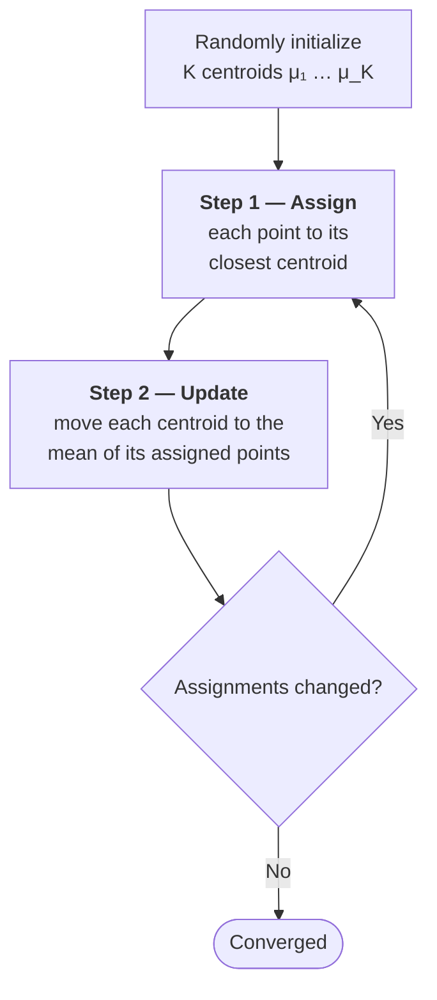
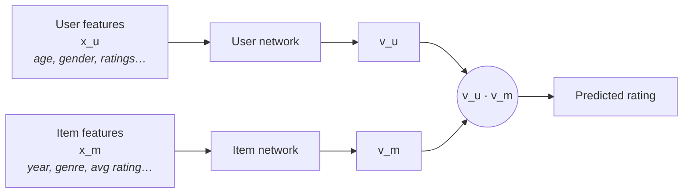
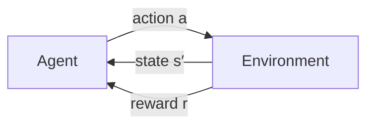
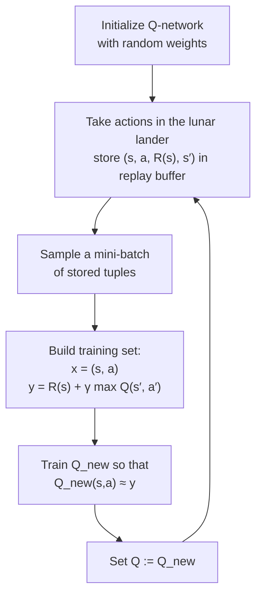

# 03 — Unsupervised Learning, Recommenders, Reinforcement Learning

> [!NOTE]
> Notes and lab solutions for **Course 3** of the DeepLearning.AI / Stanford Machine Learning Specialization.
> Course home: <https://www.coursera.org/learn/unsupervised-learning-recommenders-reinforcement-learning/home/welcome>

## Contents

- [Week 1: Unsupervised learning](#week-1-unsupervised-learning)
  - [Notes](#notes)
  - [K-means clustering](#k-means-clustering)
  - [Anomaly detection](#anomaly-detection)
  - [Labs](#labs)
- [Week 2: Recommender systems](#week-2-recommender-systems)
  - [Colaborative filtering recommender systems](#colaborative-filtering-recommender-systems)
    - [Collaborative filtering](#collaborative-filtering)
    - [Cost function for CF](#cost-function-for-cf)
    - [Gradient descent for CF](#gradient-descent-for-cf)
    - [Binary labels for CF](#binary-labels-for-cf)
    - [Mean normalization for CF](#mean-normalization-for-cf)
    - [TensorFlow implementation of CF](#tensorflow-implementation-of-cf)
  - [Content-based filtering](#content-based-filtering)
  - [Labs](#labs-1)
- [Week 3 Reinforcement Learning](#week-3-reinforcement-learning)
  - [Reinforcement Learning introduction](#reinforcement-learning-introduction)
  - [State-action value function](#state-action-value-function)
  - [Bellman Equation](#bellman-equation)
  - [Deep Reinforcement learning](#deep-reinforcement-learning)
  - [Labs](#labs-2)

---

## Week 1: Unsupervised learning

> [!NOTE]
> This week, you will learn two key unsupervised learning algorithms: clustering and anomaly detection.

<b>Learning Objectives</b>

* Implement the k-means clustering algorithm
* Implement the k-means optimization objective
* Initialize the k-means algorithm
* Choose the number of clusters for the k-means algorithm
* Implement an anomaly detection system
* Decide when to use supervised learning vs. anomaly detection
* Implement the centroid update function in k-means
* Implement the function that finds the closest centroids to each point in k-means

### Notes

* __Unsupervised learning__ — learning from data that is not labeled.

* __Clustering__ — grouping data points into clusters of similar examples.

### K-means clustering

  

* K-means is the most popular clustering algorithm.
* It is an iterative algorithm that tries to partition the dataset into K clusters, where each cluster is represented by its __centroid__ (the mean of the points in the cluster).
* The algorithm iteratively assigns each data point to the closest cluster __centroid__ and then updates the centroids based on the mean of the assigned points.

* **Step 1:** Assign each point to its closest centroid to form K clusters.

  

* **Step 2:** Recompute the centroids.

  

* __K-means algorithm__
  * Edge case: if a centroid has no points assigned to it, we can choose a random data point as the new centroid or we can remove that centroid from the algorithm.
  * Convergence: the K-means algorithm is guaranteed to converge to a local minimum, but it may not converge to the global minimum.

> [!TIP]
> Because K-means only finds a *local* minimum, run it 50–1000 times with different random initializations and keep the run with the lowest distortion $J$.

  

* __K-means optimization objective__
  * The K-means algorithm is trying to minimize the following cost function, also called `distortion`:

$$J(c^{(1)}, \ldots, c^{(m)}, \mu_1, \ldots, \mu_K) = \frac{1}{m} \sum_{i=1}^m ||x^{(i)} - \mu_{c^{(i)}}||^2$$

  * Where:
    * $m$ is the number of training examples.
    * $x^{(i)}$ is the i-th training example.
    * $c^{(i)}$ is the index of the cluster to which the i-th training example is assigned.
    * $\mu_k$ is the centroid of the k-th cluster.
    * $||x^{(i)} - \mu_{c^{(i)}}||^2$ is the squared distance between the i-th training example and the centroid of the cluster to which it is assigned.

  

* __Initialization of K-means__
  * Random initialization: randomly select K data points as initial centroids.

* __Choosing the number of clusters K__
  * Elbow method: plot the cost function J as a function of K and look for an "elbow" in the graph where the cost starts to decrease more slowly.

### Anomaly detection

Identifying data points that are significantly different from the majority of the data. This can be useful for tasks such as fraud detection, network security, and quality control.

  

* __Density estimation__

A common approach to anomaly detection is to estimate the probability density function of the data and then flag data points that have a low probability as anomalies.

* __Gaussian distribution__

  

* __Anomaly detection algorithm with one feature__
  * Estimate the parameters $\mu$ and $\sigma^2$ of the Gaussian distribution using the training data.
  * For a new data point $x$, compute the probability density function $p(x)$ using the estimated parameters.
  * Flag $x$ as an anomaly if $p(x) < \epsilon$, where $\epsilon$ is a threshold that you can choose based on your desired false positive rate.

  

* __Anomaly detection algorithm with multiple features__
  * Estimate the parameters $\mu$ and $\sigma^2$ of the multivariate Gaussian distribution using the training data.
  * For a new data point $x$, compute the probability density function $p(x)$ using the estimated parameters.
  * Flag $x$ as an anomaly if $p(x) < \epsilon$, where $\epsilon$ is a threshold that you can choose based on your desired false positive rate.

  

* __Developing and evaluating an anomaly detection system__
  * Split your data into 3 sets: __training set__, __cross-validation set__, and __test set__.
  * Use the training set to estimate the parameters of the Gaussian distribution.
  * Use the cross-validation set to select the threshold $\epsilon$ that gives you the desired false positive rate.
  * Use the test set to evaluate the performance of your anomaly detection system.
  * Example of dataset for anomaly detection of aircraft engine failure — there are 2 situations:
    * 20 anomalies out of 10 000 data points
    * 2 anomalies out of 10 000 data points

  

* __Anomaly detection vs supervised learning__

| | Anomaly detection | Supervised learning |
|---|---|---|
| **Positive examples** | Very few (0–20) | Many |
| **Negative examples** | Many | Many |
| **Anomaly types** | Many different, future ones may look unlike any seen so far | Enough examples for the algorithm to learn what positives look like |
| **Typical use** | Fraud detection, manufacturing defects, monitoring machines | Spam, weather prediction, disease classification |

  

* __Choosing Features for anomaly detection__
  * The choice of features is crucial for the performance of an anomaly detection system. You should choose features that are relevant to the problem and that can help distinguish between normal and anomalous data points.
  * For example, in the case of aircraft engine failure, you might choose features such as temperature, pressure, and vibration.

### Labs

| # | Lab | What you build |
|:--:|-----|----------------|
| 01 | [K-means clustering](01_week/C3_W1_KMeans_Assignment.ipynb) | Implement assignment/update steps, then compress an image |
| 02 | [Anomaly detection](01_week/C3_W1_Anomaly_Detection.ipynb) | Fit Gaussians to server metrics and tune $\epsilon$ |

---

## Week 2: Recommender systems

> [!NOTE]
> This week you'll build two families of recommender system — collaborative filtering, which learns from the ratings themselves, and content-based filtering, which learns from features of the users and items.

<b>Learning Objectives</b>

* Implement __collaborative filtering__ recommender systems in TensorFlow.
* Implement deep learning __content based filtering__ using a neural network in TensorFlow.
* Understand ethical considerations in building recommender systems.

  

### Colaborative filtering recommender systems

#### Collaborative filtering

* Is a method of making recommendations based on the preferences of similar users.

* The idea is to find users who have similar preferences and then recommend items that those similar users have liked.

  

#### Cost function for CF

To learn parameters w and b for collaborative filtering, we can use the following cost function.

  

* Function to learn features x for collaborative filtering, where x represents the features of the items (e.g., movies) that users interact with. In collaborative filtering, we want to learn both the parameters w and b for the users, as well as the features x for the items.
* The cost function for learning features x can be defined as follows, where:
  * $m$ is the number of users.
  * $n$ is the number of items (e.g., movies).
  * $f_{w,b}(x^{(i)})$ is the predicted rating for user i and item j
  * $y^{(i,j)}$ is the actual rating given by user i for movie j.
  * $\lambda$ is a regularization parameter to prevent overfitting.
  * The first term in the cost function measures the difference between the predicted ratings and the actual ratings, while the second term adds a regularization penalty to prevent overfitting by encouraging smaller feature values.

$$J(x) = \frac{1}{2m} \sum_{i=1}^m \sum_{j=1}^n (f_{w,b}(x^{(i)}) - y^{(i,j)})^2 + \frac{\lambda}{2} \sum_{j=1}^n ||x^{(j)}||^2$$

  

* If we do not have features for the items (e.g., movies), we can learn them from the data using a similar cost function.
* In this case, we would learn the features x for the items, while keeping the parameters w and b fixed. The cost function for learning features x can be defined as follows:

$$J(x) = \frac{1}{2m} \sum_{i=1}^m \sum_{j=1}^n (f_{w,b}(x^{(i)}) - y^{(i,j)})^2 + \frac{\lambda}{2} \sum_{j=1}^n ||x^{(j)}||^2$$

* Where:
  * $m$ is the number of users.
  * $n$ is the number of items (e.g., movies).
  * $f_{w,b}(x^{(i)})$ is the predicted rating for user i and item j
  * $y^{(i,j)}$ is the actual rating given by user i for movie j.
  * $\lambda$ is a regularization parameter to prevent overfitting.
  * The first term in the cost function measures the difference between the predicted ratings and the actual ratings, while the second term adds a regularization penalty to prevent overfitting by encouraging smaller feature values.

  

* Function to learn both parameters w and b (users on the example), and features x (movies) for __collaborative filtering__.

> [!IMPORTANT]
> **Why is collaborative filtering called "collaborative"?**
> Because it learns the user parameters $w, b$ **and** the item features $x$ *simultaneously* — many users collaborating by rating the same items is what makes both halves recoverable.

* The cost function for learning both parameters w and b, and features x can be defined as follows:

$$J(w,b,x) = \frac{1}{2m} \sum_{i=1}^m \sum_{j=1}^n (f_{w,b}(x^{(i)}) - y^{(i,j)})^2 + \frac{\lambda}{2} \sum_{i=1}^m (||w^{(i)}||^2 + b^{(i)2}) + \frac{\lambda}{2} \sum_{j=1}^n ||x^{(j)}||^2$$

Where:
* $m$ is the number of users.
* $n$ is the number of items (e.g., movies).
* $f_{w,b}(x^{(i)})$ is the predicted rating for user i and item j.
* $y^{(i,j)}$ is the actual rating given by user i for movie j.
* $\lambda$ is a regularization parameter to prevent overfitting.
* The first term in the cost function measures the difference between the predicted ratings and the actual ratings, while the second and third terms add regularization penalties to prevent overfitting by encouraging smaller parameter values for both the users and the items.

  

#### Gradient descent for CF

* To learn the parameters w and b for the users, and the features x for the items (e.g., movies) simultaneously, we can use gradient descent to minimize the cost function J(w,b,x).
* The update rules for the parameters w and b, and the features x can be derived from the cost function as follows:

$$w^{(i)} := w^{(i)} - \alpha \frac{\partial J(w,b,x)}{\partial w^{(i)}}$$
$$b^{(i)} := b^{(i)} - \alpha \frac{\partial J(w,b,x)}{\partial b^{(i)}}$$
$$x^{(j)} := x^{(j)} - \alpha \frac{\partial J(w,b,x)}{\partial x^{(j)}}$$

* Where:
  * $\alpha$ is the learning rate.
  * The gradients can be computed using the cost function J(w,b,x) and the predicted ratings $f_{w,b}(x^{(i)})$.
  * The update rules will iteratively adjust the parameters w and b for the users, and the features x for the items until convergence, where the cost function J(w,b,x) is minimized.

  

#### Binary labels for CF

* __Binary labels__ can be used in collaborative filtering when we only have information about whether a user liked an item or not, rather than the actual rating, e.g., 1 for liked and 0 for not liked.
* Previously, we have been working with ratings as labels, which are continuous values. However, in many cases, we only have binary labels, such as whether a user liked an item or not. In this case, we can use a different cost function that is more appropriate for binary labels.

* Cost function for binary labels

$$J(w,b) = -\frac{1}{m} \sum_{i=1}^m \left[ y^{(i)} \log(f_{w,b}(x^{(i)})) + (1 - y^{(i)}) \log(1 - f_{w,b}(x^{(i)})) \right]$$

  * Where $f_{w,b}(x^{(i)})$ is the predicted probability that user $i$ will like item $j$, and $y^{(i)}$ is the actual label (1 if the user liked the item, 0 otherwise).
  * This cost function is known as the __binary cross-entropy loss__.
  * $f_{w,b}(x^{(i)})$ can be calculated using the __sigmoid function__, which maps the output of the linear model to a value between 0 and 1, representing the predicted probability of the user liking the item:

$$f_{w,b}(x^{(i)}) = \sigma(w^T x^{(i)} + b) = \frac{1}{1 + e^{-(w^T x^{(i)} + b)}}$$

  

#### Mean normalization for CF

* To improve the performance of collaborative filtering, we can apply __mean normalization__ to the ratings. This involves subtracting the mean rating for each item from the ratings before training the model. This helps to account for differences in user preferences and can lead to better recommendations.

* Normalization by rows (users) or by columns (items): when a new customer is added use normalization by rows (example below); when a new movie is added use normalization by columns.

  

#### TensorFlow implementation of CF

* In TensorFlow, we can implement collaborative filtering using the __Keras__ API.
* We can define a model that takes the user and item features as input and outputs the predicted rating.
* We can then compile the model with the appropriate loss function (e.g., binary cross-entropy for binary labels) and optimizer (e.g., Adam), and train the model on the training data.
* After training, we can use the model to make predictions for new user-item pairs and generate recommendations based on those predictions.

* Gradient descent reminder from previous weeks:

  

* __Auto Diff__ in TensorFlow: automatically compute derivatives for gradient descent.

  

* Finding related items — item $k$ is similar to item $i$ when $||x^{(k)} - x^{(i)}||^2$ is small.

  

> [!WARNING]
> **Limitations of collaborative filtering**
> * **Cold start problem** — when a new user or item is added to the system, there is no historical data to make recommendations from.
> * **User side information** — collaborative filtering does not take into account features of the users, such as demographics or preferences, which can be useful for making recommendations.

### Content-based filtering

* Finding similar items based on the features of the items themselves, rather than the preferences of similar users.

* Collaborative filtering vs content-based filtering:
  * __Collaborative filtering:__ makes recommendations based on the preferences of similar users.
  * __Content-based filtering:__ makes recommendations based on the features of the items themselves.

  

* Content-based neural network architecture — two towers, one for the user and one for the item, whose outputs are combined with a dot product.

  

* Content-based filtering cost function

  

* Finding similar items using content-based filtering

  

* Recommending from a large catalogue — done in two steps:
  * __Retrieval__: generate a large list of plausible candidates (e.g., similar items to the user's recent picks, top items in their favourite genres).
  * __Ranking__: score that shorter list with the learned model and display the top results.

### Labs

| # | Lab | What you build |
|:--:|-----|----------------|
| 01 | [Collaborative Filtering Recommender Systems](02_week/C3_W2_colaborative_filtering/C3_W2_Collaborative_RecSys_Assignment.ipynb) | Movie recommender learning $w$, $b$ and $x$ with `GradientTape` |
| 02 | [Content-Based Filtering Recommender Systems](02_week/C2_W2_content_based_filtering/C3_W2_RecSysNN_Assignment.ipynb) | Two-tower neural network on the MovieLens dataset |

---

## Week 3 Reinforcement Learning

> [!NOTE]
> This week, you will learn about reinforcement learning, and build a deep Q-learning neural network in order to land a virtual lunar lander on Mars!

<b>Learning Objectives</b>

* Understand key terms such as return, state, action, and policy as it applies to reinforcement learning
* Understand the Bellman equations
* Understand the state-action value function
* Understand continuous state spaces
* Build a deep Q-learning network

### Reinforcement Learning introduction

  

  

### State-action value function

* State action value function: $Q(s,a)$ represents the expected return (cumulative future reward) of taking action a in state s and following a certain policy thereafter. The goal of reinforcement learning is to learn an optimal policy that maximizes the expected return, which can be achieved by learning the optimal state-action value function $Q^*(s,a)$.

  

### Bellman Equation

* The Bellman equation is a fundamental equation in reinforcement learning that describes the relationship between the value of a state and the values of its successor states. It can be expressed as follows:

$$Q(s,a) = \mathbb{E}[r + \gamma \max_{a'} Q(s',a') | s, a]$$

where $Q(s,a)$ is the state-action value function, $r$ is the reward received after taking action $a$ in state $s$, $\gamma$ is the discount factor that determines the importance of future rewards, and $s'$ is the next state resulting from taking action $a$ in state $s$. The Bellman equation states that the value of taking action $a$ in state $s$ is equal to the expected reward plus the discounted value of the best action in the next state $s'$. This equation is used to derive the optimal policy and to update the state-action value function during the learning process.

> [!TIP]
> Read it as two pieces: **the reward you get right now** ($r$) plus **the discounted best you can do from wherever you land next** ($\gamma \max_{a'} Q(s',a')$).

  

### Deep Reinforcement learning

* Actions and states for the lunar lander:

| 8 states | 4 actions |
|----------|-----------|
| $x$ position | do nothing |
| $y$ position | fire left orientation engine |
| $x$ velocity $\dot{x}$ | fire main engine |
| $y$ velocity $\dot{y}$ | fire right orientation engine |
| angle $\theta$ | |
| angular velocity $\dot{\theta}$ | |
| left leg contact (1 or 0) | |
| right leg contact (1 or 0) | |

  

* Rewards

  

* Policy and discount factor: the objective of reinforcement learning is to learn a policy that maximizes the expected return, which is the cumulative future reward discounted by a factor $\gamma$ that determines the importance of future rewards compared to immediate rewards — here $\gamma = 0.985$.

* Deep Reinforcement Learning

  

* Building training data for deep reinforcement learning.

  

* Deep Q-learning algorithm

  

* Improved neural network architecture: instead of running 4 separate inferences for every state, it is more efficient to train a single neural network that outputs all four Q-values simultaneously.

  

* Algorithm refinement: ε-greedy policy — with probability $1-\epsilon$ pick the action that maximizes $Q(s,a)$ (*exploitation*), and with probability $\epsilon$ pick a random action (*exploration*).

  

### Labs

| # | Lab | What you build |
|:--:|-----|----------------|
| 01 | [State Action value function](03_week/01_lab_reinforcement_learning/state_action_value_function_example.ipynb) | Interactive $Q(s,a)$ explorer on the Mars rover |
| 02 | [Lunar Lander with Deep Q-learning](03_week/02_lab_lunar_lander/C3_W3_A1_Assignment.ipynb) | Train a DQN with experience replay to land the craft |

---

[⬅️ Course 02 — Advanced Learning Algorithms](../02_advanced_learning_algorithms/README.md) · [🏠 **Home**](../README.md)

